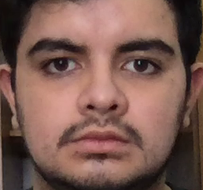
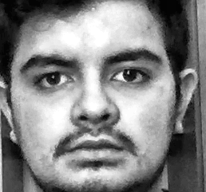
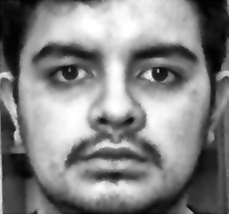
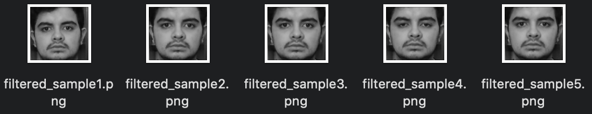
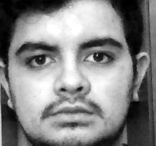

# Work Log of Andrés Duque.

***
## Need of Preprocessing Technics.
**Date:** May 19th 2020.

It all started with the need to reduce the noise produced by ilumniation and contrast conditions, as well as implicit disturbance added by webcams at the moment of taking pictures. These circumstances led to faded pictures that hamper the face-recognition process from the fliters. 

In that order of ideas, it is necessary to set up a preprocessing protocol, which must be applied to every image whether it is kept in the database or used in order to test the application developed. This protocol must include 
  
  * Hue and saturation levels adjustment.
  * Brightness and contrast improvement.
  * Transformation from 24 bit RGB to 8 bit Grayscale.
  * Noise redutcion - specialized filter.
  * Contour enhancement. 

***
## Exploring Preprocessing Technics.
**Date:** May 24th 2020

Since this is a fully developed Matlab application, it is convenient to explore the *Image Processing Toolbox* in order to achieve the preprocessing expected. Afterwards, it was tested a set of brightness and contrast adjustment functions that were applied after transforming the image from 24 bit RGB to 8 bit grayscale using ```rgb2gray()```, as is shown downwards with one of the database pictures.

 Original Sample | Enhanced Sample  
:-------------------------:|:-------------------------:
  |  

The following code contains the sequence followed in the current enhancement:

```
   I = rgb2gray(RGB)
   I1 = imadjust(I);
   I2 = histeq(I1);
   I3 = adapthisteq(I2); 
```

where ```imadjust()``` corrects intensity values, ```histeq()``` enhances contrast using histogram equalization and ```adapthisteq()``` restrict contrast amplification during histogram equalizations. 

***
## Random Noise Reduction with Wiener Filter
**Date:** May 31st 2020

As it was mentioned before, despite of adjusting image properties such as brightness or contrast, for an optimal preprocessing protocol it is necessary to attemp to reduce noise produce due to exposure and *ISO* speed from webcams or lack of brightness. The Wiener filter is used to produce a filtered signal from a noisy and stationary signal. The Matlab function ```wiener2()``` takes advantage of this propertie by stimating the local image mean and standard deviation from a selected neighbourhood. 

The Wiener filter is appropriate for treating *random noise* ocasioned by intensity fluctuations. Particularly in this project, a 5-pixel neighbourhood is optimal due to the standard size of pictures 308x267. Downwards, it is shown a comparison between an image and its enhanced and filtered result. 

Original Sample | Enhanced Sample | Filtered Sample
:-------------------------:|:-------------------------:|:-------------------------:
  |   |  

The command ```wiener2(I,[5 5])``` is used for applying this filter in the current grayscale images shown above. 

***
## Contour Enhancement in GrayScale Images
**Date:** June 6th 2020

Now, that there is an acceptable protocol for noise reduction and bright and contrast adjustment. We shall look forward into augmenting the sharpness of contours. A simplified way to carry this through is by attemping to reduce the blurred details in pictures. Here below, it is possible to find an effort to achieve this objective.

```
   I = rgb2gray(RGB);
   se = strel('disk',100);
   background = imopen(I,se);
   I2 = I - rgb2gray(background);
   I3 = imadjust(I2);
```

```strel()``` is a function that displays a disk over the image within a radius of 100 pixels replacing al matrix values for and specific one. There after, it is subtracted from the grayscale image in order to enhance the facial silhouette. One can appreciate its results in the grid from below.

Original Sample | Enhanced Sample | Corrected Sample
:-------------------------:|:-------------------------:|:-------------------------:
  |   |  

***
## Standarization and Automation of Preprocessing Codes
**Date:** June 10th 2020

Since preprocessing protocol has to be applied to every image that is included in the development of facial recognition filter, it was necessary to come up with a technic that can treat simultaneously a large amount of images, i.e., a database. The following code is used to call a set of images from a directory and with the help of a loop it was possible to refine all at once. 

```
    %% Look for the images
    basedir = pwd();
    Path = strcat(basedir,'/',dirname);
    images = dir(fullfile(Path,'*.png'));
    %% Creates destination folder
    mkdir(strcat(basedir,'/',dirname,'_filtered'))
    address = [basedir '/' dirname '_filtered/' 'filtered_sample'];
```

Now that images are treated, it is needed to save them with the appropriate name in a new directory. The code that is presented below, collects the result images in a repository with the name of the process executed.

```
    %% Save the image
    where = [strcat(address,num2str(k),'.png')];
    imwrite(I3,where);
```
Here it is a example of the saving process.

Directory Names from Preprocessed Databases|
:-------------------------:|


Images Names from Preprocessed Database with Wiener Filter|
:-------------------------:|
  

***
## Fixed Pattern Noise Reduction
**Date:** June 13th 2020
As it was mentioned before, webcams add noise due to exposure and *ISO* speed. Fixed pattern noise is caused by long exposure and is easy recognized as a result of intensity peaks that surpasses random noise. However, it can be easily corrected by subtracting a 'dark' picture from the webcam.

```
    I = rgb2gray(RGB);
    I2 = I - I0;
    I3 = imadjust(I2);
```

where ```I0``` stands for the 'dark' image taken. The comparison between the samples by applying a *FPN* correction is shown below.

Original Sample | Enhanced Sample | FPN Sample
:-------------------------:|:-------------------------:|:-------------------------:
  |   |  
    
*** 
## Testing Preprocessing Protocol with HBCOM Filter
**Date:** June 18th 2020

***
