# Work Log- Luis D.
***
## MAY 21st 2020.
Today the work was mainly focused on finishing the update of github's wiki page in terms of the VLC correlator and face recognition codes developed to date and their respective implementations. The update contains the most important results obtained at the moment alongside the issues presented and the discussions and ideas that have come up to solve them.
Additionally, the already constructed function aquire_data.m was implemented to get the Reference pictures in an easier manner, since up until now i've been taking, chopping and storing the photos one by one, which is a very unproductive to do so.    
***
## MAY 22nd 2020
Today my attempt was to check how to use the normalize function as an image preprocessing technique to solve problems with brightness and intensituy on the picture. At first i noticed that applying the function directly after reading the image gives an error which also appears when trying to implement the normalization to a gray scaled picture. The error is:

Error using normalize>checkSupportedArray (line 176)
Invalid data type. First argument must be of type double, single, table, or timetable.

Error in normalize (line 87)
    checkSupportedArray(A,method,methodType,false);

Now, it appears to be that using the function im2double or mat2gray before normalization solves the issue. However, the question about if the normalization should be before or after normalizing arises. For this, i tried three  methods:

- In the first one we normalized before gray scaling which for a random image gives a standard deviation of 0.9988 and after gray scaling the std gives 0.2677
- For the second we normalized after gray scaling which for a random image gives a standard deviation of 0.9988. Keep in mind that the calculations are made with gray scaled images.
- Finally in the third one, we apply the im2double function imidietly after reading, but the normalization is done after gray scaling, which gives again a std of 0.9988.

Next, we executed these three methods in our correlation code for a VLC face recognition simulation. Where the reference set was formed with 20 images.
Compared to the original results (with no normalization) the correlation plane appears with more noise in all cases, but also the peak does not look reliable in the mthods 2 and 3. The peak for the first method is shorter compared to the original result, whiich could be due to the normalization, however its sharpnes and brightness, is not good.

 Target and Reference | Original Correlation result  
:-------------------------:|:-------------------------:
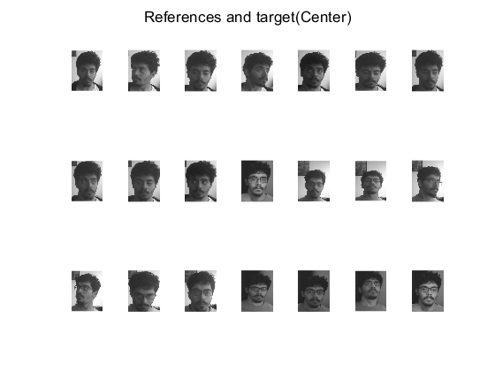  |  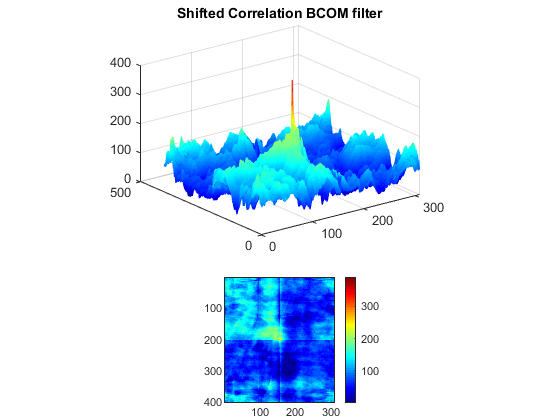

 Target and Reference | Normalized Correlation result- Method 1  
:-------------------------:|:-------------------------:
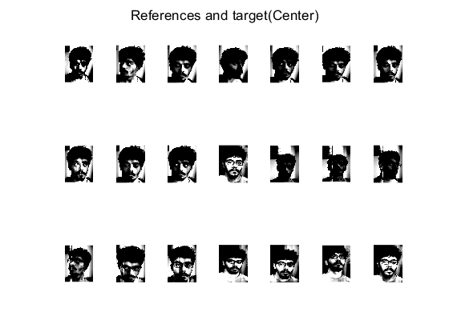  |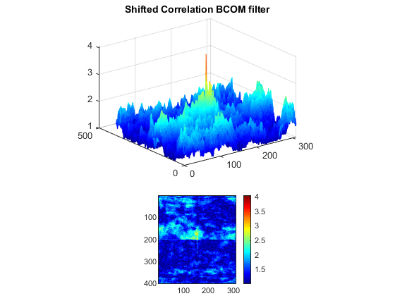
Normalized Correlation result- Method 2 | Normalized Correlation result- Method 3  
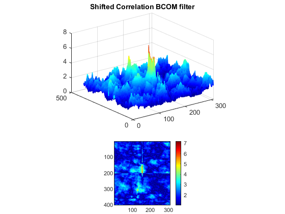  |  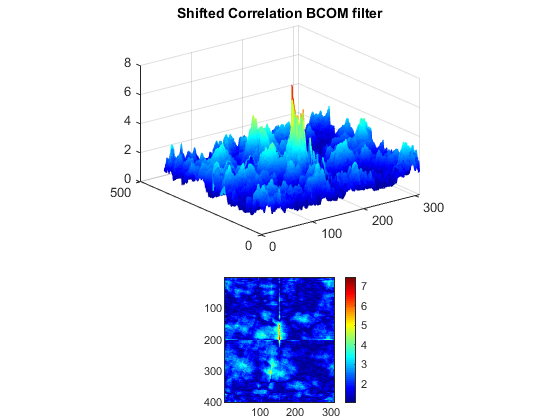

However, is worth mentioning that these bad results were obtain for images with a very darker ilumination in comparison to most of the reference set. That being said, those pictures whose brightness is similar to the majority of the reference set give better results, specially when the subject is not wearing glasses.

 Target and Reference | Normalized Correlation result- Method 1  
:-------------------------:|:-------------------------:
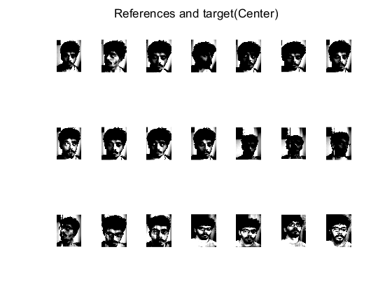  |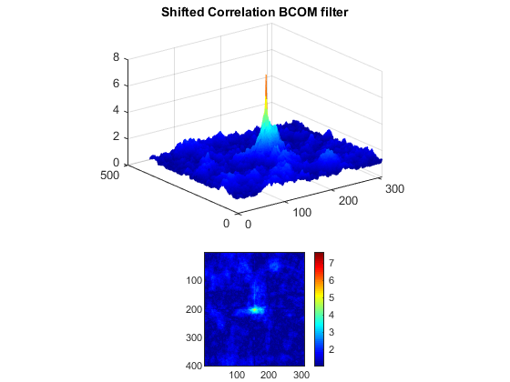
Normalized Correlation result- Method 2 | Normalized Correlation result- Method 3  
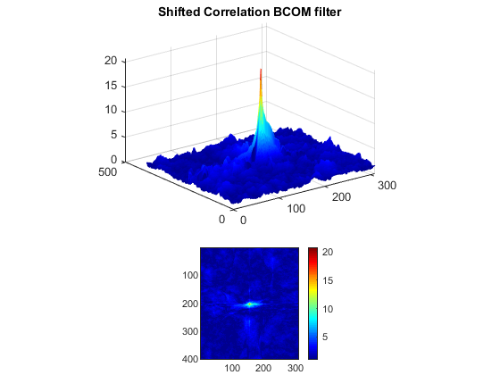  |  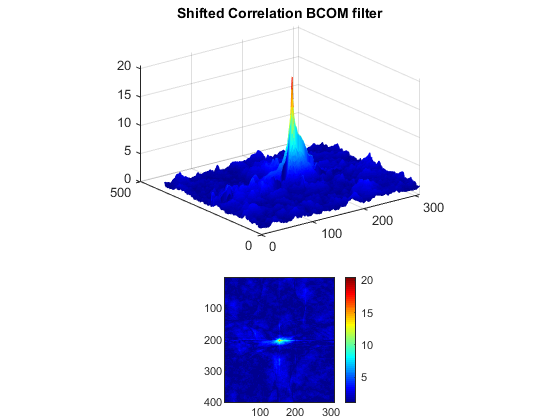

For these new cases, one can see that for all cases the noise is lower and the peaks are better formed and higher than before. Particulary, methods 2 and 3 (which have in common that normalization is made after gray scaling) are the highest ones. Therefore, a first conclusion would be (again) that is extremly important to define a protocol to take the pictures, and also to have a proper ilumination.
***
## MAY 23rd 2020
Today, i design the proper rectangle of image acquisition for my own scene and camera characteristics, hence now the process of taking and storing the photos can be done faster, then a new sample of 50 images was taken using a light blue bed sheet as a background screen. Futhermore, i was finally able to improve the main structure of the codes for the VLC face recognition program, this was done by enhacing its capacity to perform operations thanks to the usage of the function "cell" and the command "for" which allowed me to do operations like image reading, gray scaling, matrix multiplications and sums in a more compact manner, avoiding tedious manual typing  and thus amplifying the code's capacity.   

Now, the three normalization methods disscused yesterday were applyied to this new code structure, and even though the mixed results remain exactly the same (since i didn't change the ref set here), the compilation and typing process clearly was much faster. Codes are named VLCNormBetter, VLCNorm2Better, VLCNorm3Better.

Finally i wrote a code (VLCfaceBetter2) for face recognition using the new structure and the 50 samples se, which also includes all 3 normalization methods, which can be exchanged by commenting (with %) certain parts properly, this also works if one wants to run the code without normalizing. The results for the normalization remain pretty variable depending on the input target image, however the peaks are in most cases narrower and higher than before (at least in methods 2 and 3). My guess is that ilumination problems remain, therefore the next step would be to change the light source.
***
## MAY 24th/2020
Today, my work was focused on trying to solve the issues i've been having with normalization, for this i tried with different approaches, all which had in common the usage of a new function that asigns by default new intensity values to a gray scale image ("imadjust").
- On my first attempt i applied the imadjust function after im2double and before normalization, resulting in most cases in the same surfaces i had obtain yesterday.
- My second option was to adjust the intensities after both doubuling and normalizing the image, obtaining a little shorter peaks and more noticible noise in the plane.
- As a third choice i implemented before imdouble and normalizing, which resulted again in the same results for correlation as yesterday.

Giving this results, i repeated them in an identical manner but performing the normalization in another way, by using mat2gray(image./sqrt(sum(image(:).^2))), which gave worse results than before, obtaining an even shorter and disorted peak, less sharp than before and also (in some cases) other bright spots mixed with more noise.

A conlusion to all this would be that either one has to asign manually the new intensity values or to focus more on the improvment of the image taking process.
I tried to add the new intensity values by myself using  imadjust(I,[low_in high_in]), which allowed me to put values between 0 and 1. I implemented this new form for intensity adjustment for all options i propose today, resulting in a new option, the best at the moment, described as follows:

Use im2doulble and normalization function imediatly after gray scaling, then use the adjustment function with values [0.07 0.2] and finally perform a new normalization. This method gave for most cases a shorter peak, however the noise was lower as well.
Bellow there're two examples: one where this method gave really good results and other where the results were no so good but defenetly better compared to its previous version in terms of noise and peak sharpness (even though it might be shorter).

Gray sacale picture | Normalized Image  
:-------------------------:|:-------------------------:
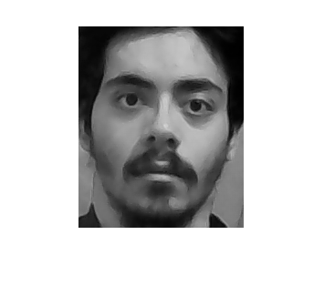  |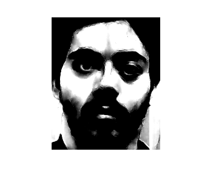
Intensity adjustment | Renormalized Image  
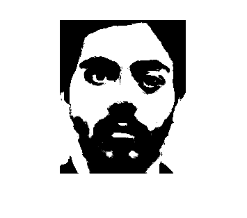  |  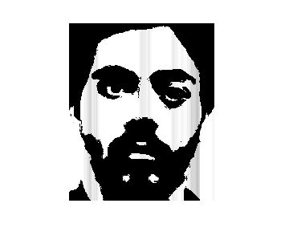

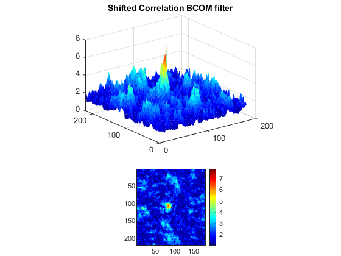

Gray sacale picture | Normalized Image  
:-------------------------:|:-------------------------:
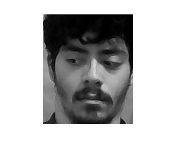  |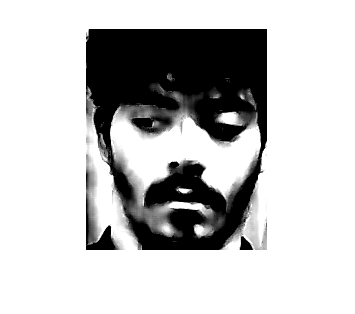
Intensity adjustment | Renormalized Image  
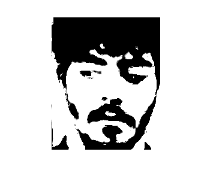  |  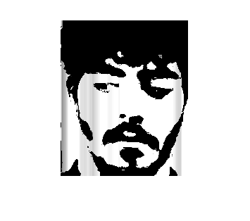

Finally, i noticed that most of the pictures that give better results are those in which my hair covers my forehead. These type of images represent the mayority of the reference set, which could be something to take into account. Futhermore, when the test image is not one of the references, results are bad still. The last code structure used today was uploaded by the name "VLCfaceBetter3"

***
## MAY 27th 2020
Today a new trial was made, following the last method used, i tried using the negative of the image to calcultate the correlation. To obtain the negative image, the function 	"imcomplement" was used, and for the code it was applyied after renormalization which in general gives a brighter peak, but with a little increase in noise and for those cases where the results have been good, it also gives a higher peak. For the target images that have been giving bad results, the peak seems to be higher but it's not very noticible and the noise remains parcticly the same, in some cases even a little noisier. At the end, a suggestion to use the edge function was made. The function helps to detect edges on an image by returning a binarize image highlighting the detected borders, it also can be implemented with various  recognition methods.

***
## MAY 29th 2020
Today i implemented the edge function (inmediatly afrter using "imcomplement") which in general gives really good results, decreasing the noise in most cases and giving bright peaks. For the implementation, three edge detection methods were performed  'canny', 'sobel' and 'log', where the latter proves to have a better performance in comparison. Therefore, as an example of an imput image with bad results and another with a good correlation plane we use the same ones as before.

Input | Canny edge detection  
:-------------------------:|:-------------------------:
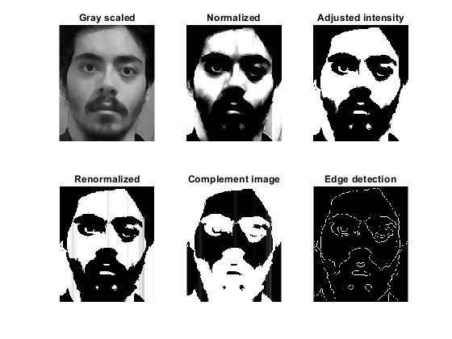 |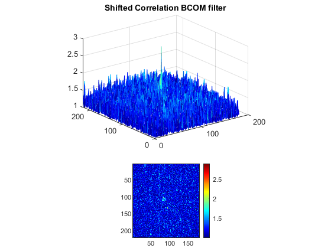
Sobel edge detection | Log edge detection  
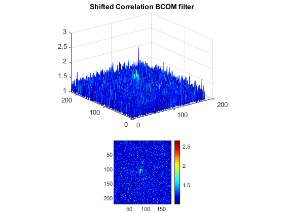|  

Input | Canny edge detection  
:-------------------------:|:-------------------------:
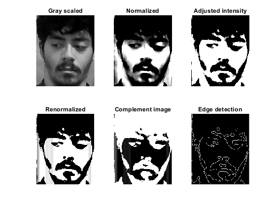 |
Sobel edge detection | Log edge detection  
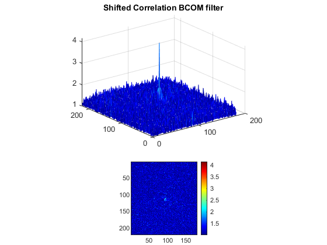|  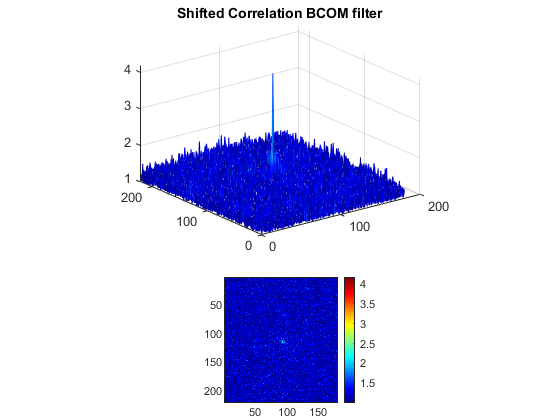

As mentioned above, the log method for edge detection gives really good results even for an image that used to cause problems in previous attempts. However, even though the noise is way much lower than before, the ideal result is to make it zero. The next suggested step is to implement a high pass filter as an image processing tool to highlight the edges in a better way. The code used today was uploaded by the name "VLCfaceBetter4"

***
## MAY 30th 2020
Today i added a new function to the structure i had before, called "bwlabel" which works for a binary picture (hence it must be implemented after applying the log method edge detection) and gives a label matrix that contains labels for connected elements on the picture. In comparison, the subject image doesn't look too altered, but the correlation plane on the other hand certainly has a significant change.
In the correlation plane, the general results show a much higher peak in comparison to previous results, futhermore the noise on the plane is significantly attenuated and lower than the peak, which is definetly a good sign for the general performance. These results can be seen bellow. As always we show the examples for the same images (the "bad" and the "good" one):

Input | Log edge detection | Log edge detection + label function
:-------------------------:|:-------------------------:|:-------------------------:
 || 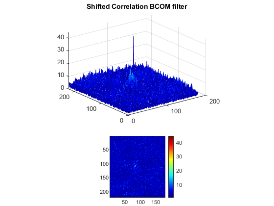

Input | Log edge detection | Log edge detection + label function
:-------------------------:|:-------------------------:|:-------------------------:
 || 

As a final comment for this section, is fair to say this new function was added to the previous code so it was reuploaded with the same name "VLCfaceBetter4" to avoid an accummulation of many codes.

For the second part of today's work, i took the firsts steps for future filter training
by adding a  new part to the code in order to calculate the test image self correlation, in order to observe how well is the performance of the filter. Hence, the self-correlation results for the two example images are shown bellow:

Image | Self-Correlation
:-------------------------:|:-------------------------:
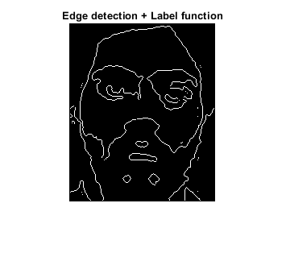 |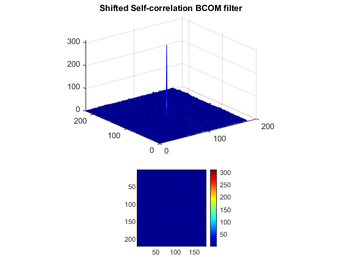

Image | Self-Correlation
:-------------------------:|:-------------------------:
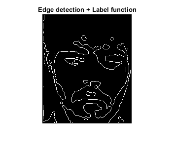 |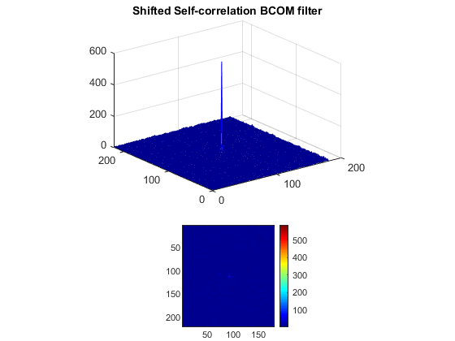

Based on these figures, one can see that the filter that's being implemented (plus the preprossecing done with normalizaton, edges and intensity adjustment) has a really good and reliable performance. This means, that noise problems are mostly due to a lack of filter traning or more image pre-processing methods. This code was uploaded by the name  "VLCfaceBetter_and_SelfCorr"

***
##  June 2nd 2020
Today i made four new references sets, one with 95 sample and daylight as a source, the second one was made with 95 images and using 3pm sunlight as the source, the third set was made out of these last two, and finally the last set was constructed with 199 new photos and a normal bedroom light bulb as the source. The sets were named Sample3A, Sample3B, Sample3, Sample4 respectevly and the results obtained were very similar as before.

***
## June 4th 2020
Today i started to perform calculations related to PSE and PCE values, as a criteria to determine the reliability of the correlation plane result. For this purpose, i had to create an "impostor set of images", that is a sample of images not belonging to the reference set which also differ drasticly from those pictures (like a football ball for example). The main objectives to achive with the described set are:

1. To check the performance of the BCOM filter and the correlation plane for these impostor test images and to make sure that the code doesn't give any "false positive" on the correlation plane. Thus, proving that the code is working properly.

2. To plot the PSE and PCE values obtained for each image from the impostor set and compare the results to those obtained with the actual reference set, which should be very distinguishable.

As an additional note, remember that the calculations of the linear combination coeficients were done following a PCE criteria, which consisted in cumputing separated correlations (or as we named it "partial correlations") between each reference an the test image, followed by finding the peak energy for each one of these "partial correlations" and after dividing each of them by a "energy of the plane" value we obtained a PCE for each "partial correlation" which allowed us to calculated the respective weights for the linear combination filter.

The note above is only to clarify that the PCE we're mentioning for ploting is completly different from those "partial correlations PCE's". This new PCE we're reffering to reprersents the peak to correlation energy from the actual correlation result obtained for a particular test image.   

For these impostor test sample, i build a set of 14 images. Since the reference set is way bigger, for the plots we only used 14 samples form the "Sample 4" reference set.
The results obtined for (1) were really good, as in all the cases tried, not a single one gave a "false positive", for most cases the result obtained in the correlation plane was just noise and in some others there was not even a correlation result (for images 2-8 and 13 specifically). Some of the obtained surfaces are shown bellow

Example 1|Example 2|
:-------------------------:|:-------------------------:
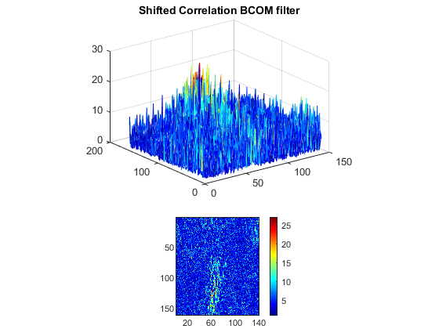|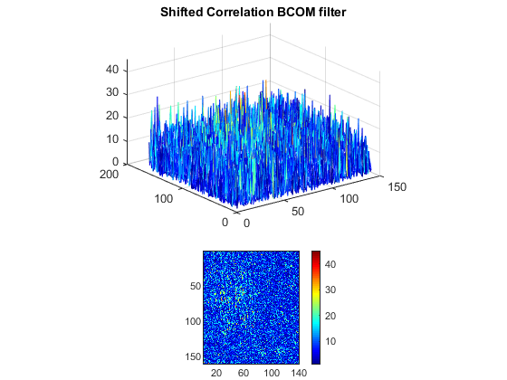
Example 3|Example 4|
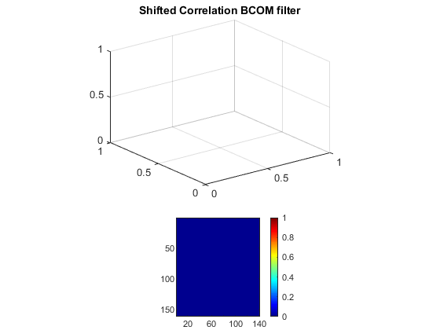 |

The results confirm that the code and the BCOM filter are working properly when it comes to identify and compare the test image with the reference set, which also is a sign of relieve about the work done up until to this point.

For part (2), as mentioned before i calculated the PCE and the PSE for all the impostor test images and plot them alongside the values acquire for 14 images from the reference set, obtaining the figures shown below:

PCE|PSE|
:-------------------------:|:-------------------------:
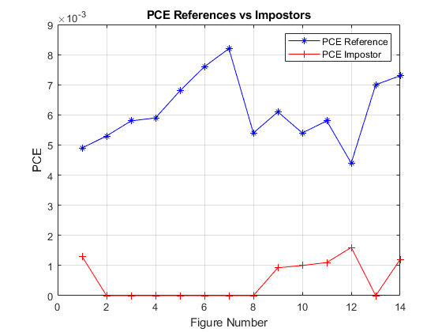|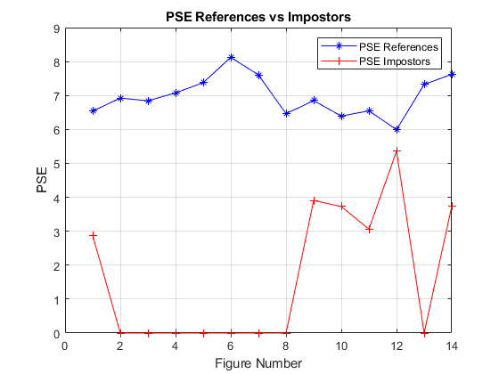
***
## JUNE 5th 2020
Today i used a new impostor images set made off 14 faces from another parner from this project. Just as before, the idea was to calculate the PCE and PSE of the impostors and compare them against the values obtain for 14 reference samples, thus checking the BCOM filter performance and verifying that there are no "false positives". Therefore, some of the results obtained on the correlation plane are shown bellow.

Example 1|Example 2|
:-------------------------:|:-------------------------:
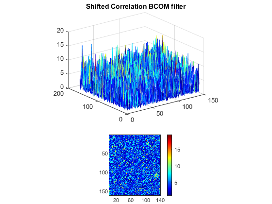|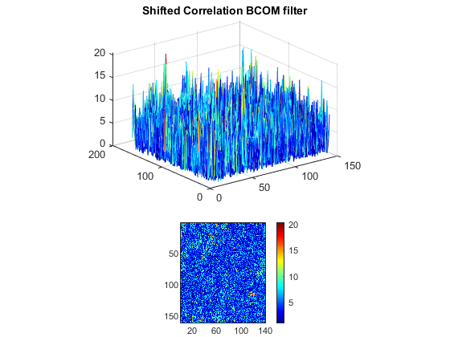
Example 3|Example 4|
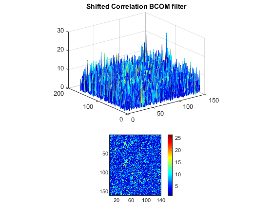 |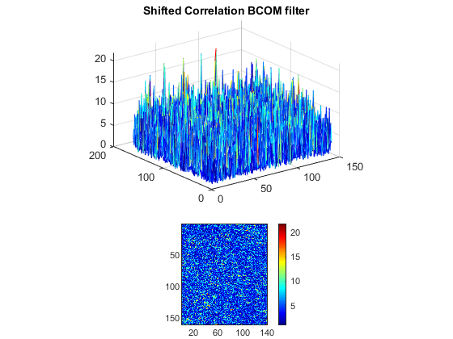

As one can see, there is no false detection in any of the cases, the surface gives a lot of noise and disorganized peaks. Next, the plots obtained for PCE and PSE values are shown bellow.    

PCE|PSE|
:-------------------------:|:-------------------------:
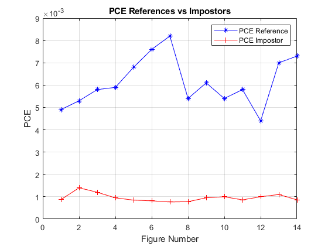|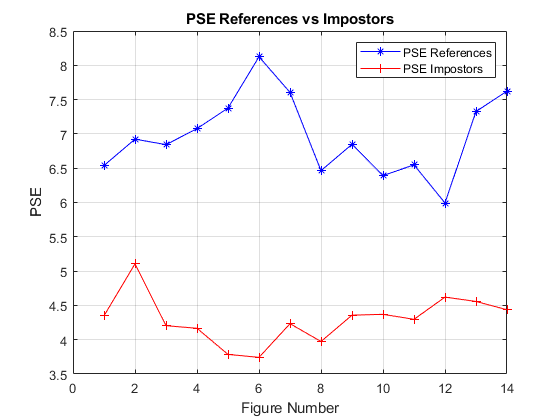

***
## JUNE 7th-9th
In these days i continued working with impostor samples and comparing their results against those obtained for the reference set. Looking at the results obtained in previous days, we noticed that the PSE values were too small, so after doing some corrections to the PSE function we performed the proper calculations and ploting to a new impostor set of  40 images, thus getting to the following results.

Example 1|Example 2|
:-------------------------:|:-------------------------:
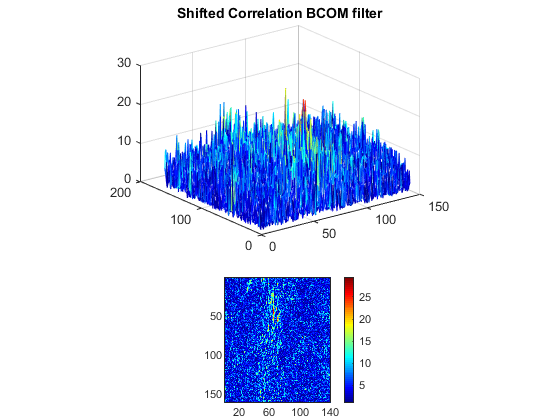|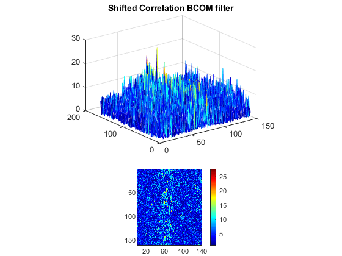

Example 3|Example 4|
:-------------------------:|:-------------------------:
 |

PCE|PSE|
:-------------------------:|:-------------------------:
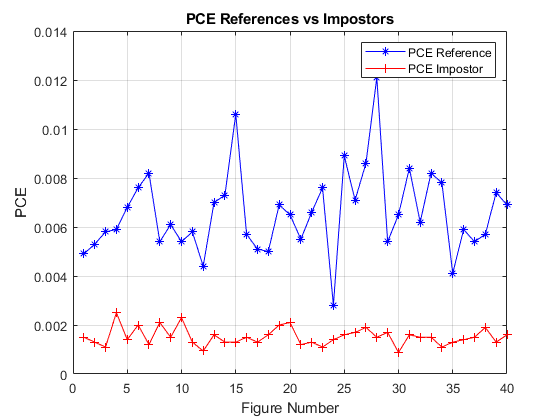|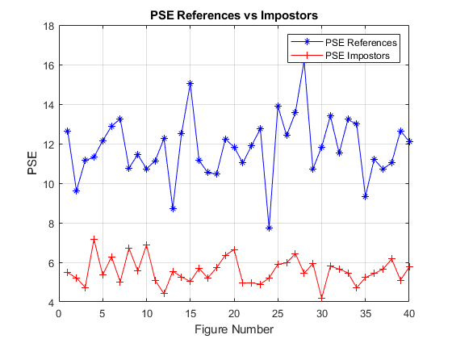

As one can see, once again there's no false detection in the correlation planes shown in the example (and neither for the rest), on the other hand we extended the number of samples to 40 in order to have a more data to analize. The code used to make these plots was uploaded by the name of PCE_and_PSE_plots. Also the code that calculates the PCE and PSE values was uploaded and named ImpostorSet_trials. Remember that this code calculates the PCE and PSE values of the total correlation plane when the test image is either an impostor or part of the reference set.

As an additional work, i made a code that plots the PSE and PCE values of an image with a good correlation plane, changing the value of alpha, which is the constant used to compute the linear combination coeficients of the filter. An example of the figures obtained is shown below:

PCE|PSE|
:-------------------------:|:-------------------------:
_PCE_alpha.png)|_PSE_alpha.png)

***
## JUNE 10th 2020
Today, as a first part of the work, i added a new function to the preprocessing part of the code.

- adapthisteq: J = adapthisteq(I) enhances the contrast of the grayscale image I by transforming the values using contrast-limited adaptive histogram equalization.

Hence, the new structure of preprocessing has this new element, which is displayed with the previous ones in the following way:

It=rgb2gray(img_t);
It=im2double(It);
It=normalize(It);
It=imadjust(It,[0.07 0.2]);
It= adapthisteq(It);
It=normalize(It);
It=imcomplement(It);
It=edge(It,'log');
It=bwlabel(It);   

Where img_t represents the original image read. Since now we have this new structure, it leads to certain changes in the codes and results we've been obtaining. Likewise,  it is observed that the PCE and PSE  values change, increasing for the real images and decreasining for the impostors. Thus, thsese new plots are shown bellow:   

PCE|PSE|
:-------------------------:|:-------------------------:
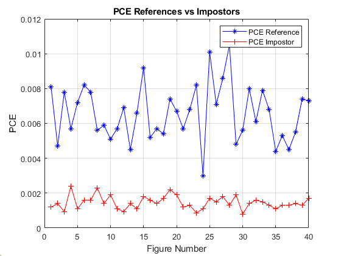|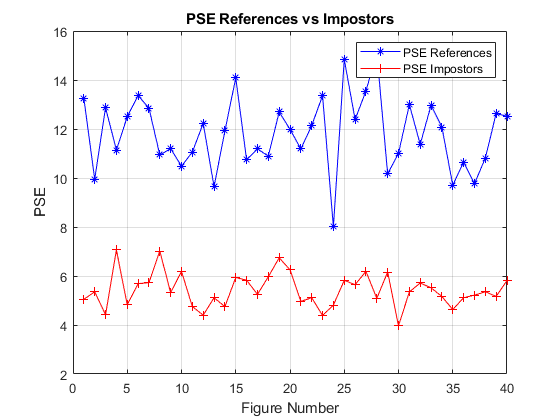

In the plots code i also added a calculation for the mean and standard deviation of the PCE and PSE values in order to create a region of acceptance that confirms a successful match, another that dictates no match and a final one that gives no conclusive result.

***
## JUNE 11 2020
Today, i used a new structure for the preprocessing part of the code in order to have three types of results for the correlation planes and the PCE and PSE plots, thus deciding which of these structures has a better performance. The mentioned structures are the one we've be using the past few weeks, the second is the one shown yesterday and  lastly, the third one is as follows:

It=rgb2gray(img_t);
se = strel('disk',70);
background = imopen(It,se);
It = It - background;
It= wiener2(It,[5 5]);
It=im2double(It);
It=normalize(It);
It=imadjust(It,[0.07 0.2]);
It=histeq(It);
It= adapthisteq(It);
It=normalize(It);
It=imcomplement(It);
It=edge(It,'log');
It=bwlabel(It);   

Where the new elements implemented are:

- strel: strel('disk',r,n) creates a disk-shaped structuring element, where r specifies the radius and n specifies the number of line structuring elements used to approximate the disk shape.
- imopen:  imopen(I,SE) performs morphological opening on the grayscale or binary image I, returning the opened image. The morphological open operation is an erosion followed by a dilation, using the same structuring element for both operations.
- wiener2: wiener2(I,[m n],noise) filters the grayscale image I using a pixel-wise adaptive low-pass Wiener filter. [m n] specifies the size (m-by-n) of the neighborhood used to estimate the local image mean and standard deviation. The additive noise (Gaussian white noise) power is assumed to be noise.
- J= histeq(I):  Transforms the grayscale image I so that the histogram of the output grayscale image J has 64 bins and is approximately flat.

For the new structure, the PCE and PSE plots are:

PCE|PSE|
:-------------------------:|:-------------------------:
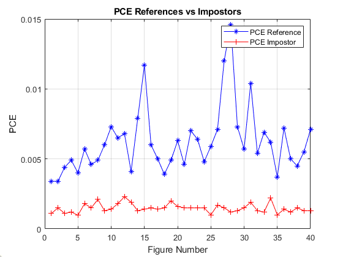|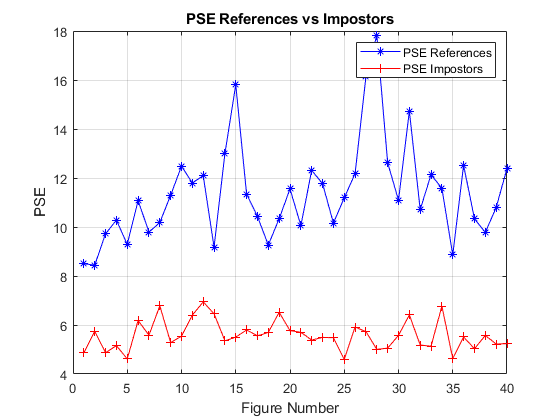

This code also includes the calculations for the mean and the standard deviation of the data. At the end, we chose the PSE as the ultimate criteria to decide weather there's a match in the plane or not. Therefore, the next step is to compare the results obtained for the three types of preprocessing structures used, but before that, keep in mind that the 40 images we've been using to plot those values, belong to the 198 samples reference set. Hence, the comparison between the plots is shown below:

PSE (Preprocessing 1)|PSE (Preprocessing 2)|PSE (Preprocessing 3)|
:-------------------------:|:-------------------------:|:-------------------------:
||

For the first type of preprocessing we have the following values:

- True PSE mean= 11.8011
- True PSE STD= 1.5893
- False PSE mean= 5.5558
- False PSE STD = 0.6629

Which would imply that the acceptance region lies between the PSE values of 10.2118 and 13.3904, and the no match region is from 4.8929 to 6.2187. Therefore, the distance between regions is 3.9934

For the second type:

- True PSE mean= 11.8065
- True PSE STD= 1.4954
- False PSE mean= 5.4210
- False PSE STD = 0.7022
Match region = [10.3111,13.3019], No Match region = [4.7188,6.1232], distance between regions is 4.1879

For the third type:

- True PSE mean= 11.3762
- True PSE STD= 2.0286
- False PSE mean= 5.5817
- False PSE STD = 0.6014
Match region = [9.3476,13.4048], No Match region = [4.9803,6.1831], distance between regions is 3.1645.

As a final way to compare these three ways to perform the image preprocessing, we take a look to the correlation planes of images with a high, a low and a PSE close to the average, thus obtaining the following results:

CORRELATION FOR HIGH PSE:

Correlation (Preprocessing 1)|Correlation (Preprocessing 2)|Correlation (Preprocessing 3)|
:-------------------------:|:-------------------------:|:-------------------------:
|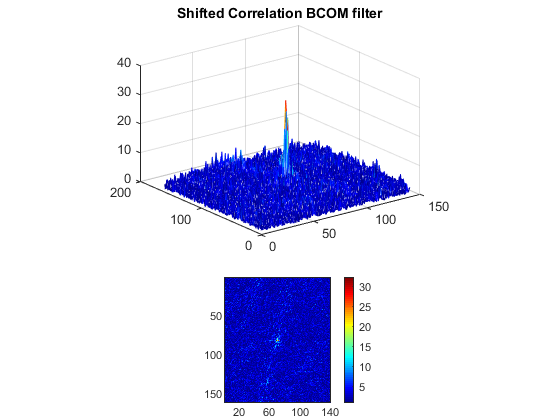|

CORRELATION FOR AVERAGE PSE:

Correlation (Preprocessing 1)|Correlation (Preprocessing 2)|Correlation (Preprocessing 3)|
:-------------------------:|:-------------------------:|:-------------------------:
||

CORRELATION FOR LOW PSE:

Correlation (Preprocessing 1)|Correlation (Preprocessing 2)|Correlation (Preprocessing 3)|
:-------------------------:|:-------------------------:|:-------------------------:
||

***

## JUNE 12th 2020

According to the results described yesterday, we can conclude that, based on the separation between regions and quality of the correlation planes, the most appropriate pre-processing methods are either the first one or the second one. Therefore, it is necessary to analize other kinds of results obtained by both methods, thus our next step is to make a graph (for each type of pre-processing) that shows the behaviour of the images that belong to the actual reference set against the impostors. The graph we are going to make is called a Receiver operating characteristics (ROC) curve, in which one plots the true positive rate (TPR) against the false positive rate (FPR) for various threshold values. The TPR is the ratio between the events that are actually categorized as a successful match and the total number of samples expected to be positive. Likewise, the FPR is the ratio of false positives and the total number of impostors. Another form of a ROC curve is to graph the False negative rate (FNR), that is the ratio of true images clasified as no match, against the FPR. Since we have to use various threshold values, that means that we must use different variations of the acceptance and no match intervals. As a final note, we are going to perform the first plots only for the 40 impostor samples and the 40 references (that belong to a sample of 198) we've been using until now.

***

## JUNE 14th 2020   
According to what's drescribed above, today a made the ROC curves for the two preprocessing approaches that we used. Since we had to use different theresholds, we constructed the acceptance and no match regions based on the mean and standard deviations from the real reference and impostor samples respectively. These regions or bands were  taken as: [mean-c*std,mean+c*std] where c is a constant and takes the values: 0.2-3.6 inreasing in steps of 0.2.
To facilitate the counting of matches we added the regions to the PSE plots. One example for c=0.6 is shown bellow:

PSE (Preprocessing 1)|PSE (Preprocessing 2)|
:-------------------------:|:-------------------------:
|

As one can see, there's a region in the middle which we call the inconclusive region. On the other hand, is clear that the acceptance and no match regions are very distant from each other due to the low PSE values from the impostor set, which means that a false positive or false negative will hardly appear unless both regions are enlarged, but doing that would decrease the code's relaiabilty. Futhermore, the fact that there's almost no false positive in any case, has a significant effect on the ROC curves:

ROC Curve (Preprocessing 1)|ROC Curve (Preprocessing 2)|
:-------------------------:|:-------------------------:
|

Just as was said before, for almost all region variations there is no false positives in both preprocessing methods, therefore the FPR values on the ROC curve stay zero for the most part. Evidently, the fact that our impostor sample PSE values differ drasticly from the references is affecting the form of the curve, thus a new way of ploting this curve is proposed:
The new idea is to only use the acceptance region, and everything outside from it has to be clasified as no match, thereafter plot a new curve as the TPR against the false negative rate (FNR), which is the ratio of true samples clasified as negative, divided by the total number of samples.       

***

## JUNE 15th 2020
Just as we described yesterday, we plot a new type of ROC curve as the TPR against the FNR, which gives the following results:

ROC Curve (Preprocessing 1)|ROC Curve (Preprocessing 2)|
:-------------------------:|:-------------------------:
|

The behaviour of the curves above shows an inverse proportionality between both rates, which was a expected result since we took false negatives as every awaited positive outside the acceptance region. As an additonal set of plots we wanted to analize the relation between these values and the match interval size, thus we ploted the ratio FNR/TPR againts the region size. The describe curves are shown bellow:

Preprocessing 1|Preprocessing 2|
:-------------------------:|:-------------------------:
|

As one can see, the ratio gets closer to zero as the region size increases, meaning that FNR is also zero which is the ideal result. However, this "perfect" result is reached for a drasticly large acceptance region which is far from reliable, therefore we need to find an optimal value on the curve, which would gives us the appropiate region size. Another observation worth making is that the graphs have an exponential-like form, which could be a characteristic to keep in mind to decide the propper region size.

***

## JUNE 16th 2020
Today i briefly tried to use once again the impostor sample approach, but this time i used as impostors a set of images  from the actual subject but with a different light  source to ilumnate the scene. However, the PSE values were just as low as the previous impostor set (a range of values between 4-7), which demonstrates that there's not really any use for an impostor set, because the filter already discards them, giving them a really low PSE value compared to the actual reference set, leaving almost no posibility to obtain a false positive just, as was happening yesterday.

As the second part of todays work, first is important to remember that the set of 40 real images we've been using throught these last few weeks, they all belong to the sample of 198 that form the BCOM filter. Now, the next step would be to implement a test sample that doesn't belong to the reference set (i.e the one used to construct the filter). The ideal case is that this new test sample has a greater number of images than the reference one, in order to have more statistical accuracy in the correlation, PSE values and ROC currves results. Thus we need to have a test sample made off around 400 images or decrease the number of images in the filter and use less samples for testing. This last solution could work since we've seen in results from the past month that the filter performs well for 50 or even 20 reference images.

Before taking the step mentioned above, what we're going to do first is to take the 40 images, utilized up to these week, out of the filter (so it would consist only on the remaining 158 which would be known as "Filter_Sample") in order to create a "Test_Sample" to test these new filter. All of this, is based on the premise that the filter must work for test images not belongiong to the filter itself, as long as the subjects and the scene characteristics between a test image and the references are the same. Therefore , since in this case both sets had the same scene illumination and properties, we should obtain acceptable results. To clarify, we are taking this middleground satage first, since at the moment storing the PSE values has had to be done manually, in a further stage we'll lower the number of filter samples and expand the test set just as was said before.

As a final note, it is worth mentioning that we'll eliminate the upper limit in the acceptance region, since it makes no sense to clasify an image with a good correlation plane and a high PSE as a no match. Hence, from now on we consider all PSE values above a minimum thereshold to be a sucessful match and all values bellow it to be a no match. In other words, the new acceptance region now has the form [mean-c*std,inf]. Where c is a value to be variable
Hence, we performed the changes mentioned above and plot new graphs for the PSE values, ROC curves and FNR/TPR, using the new standadrs of acceptance region size and doing it for both preprocessing methods.

***
## JUNE 17th 2020

According to the last comments show yesterday, the PSE plots for both preprocessing methods (with a c value of 0.6 as an example) are shown below:

PSE with Preprocessing 1|PSE with Preprocessing 2|
:-------------------------:|:-------------------------:
|

The TPR vs FNR curves gave the following results

Preprocessing 1|Preprocessing 2|
:-------------------------:|:-------------------------:
|

Finally, since for these new acceptance regions parameters we only have a thresehold determined by the PSE mean and a fraction of the standard deviation, thus instead of graphing the ratio FNR/TPR against the region size, we now plot this value against the fraction c of the std. Hence, the obtained plots are shown bellow:

Preprocessing 1|Preprocessing 2|
:-------------------------:|:-------------------------:
|

By looking at these last graphs one can see that for the preprocessing method 2, the curve goes to zero faser than the other one, which could be a good indicative to select this method as the final one. Thus, we decide to implement the second preprocessing method as the proper one for the BCOM filter and we let the acceptance threshold around mean-cxstd with c=1.5. 

***
## JUNE 19th-20th
These  two days, i started to try out the new standarized  matlab functions built by my partners, in which the data adquisition, image preprocessing, filter construction and other parts of the image analysis were synthetized in single separated functions with an stablish and more intuitive protocol. 
Therefore, i created new image samples sets trying to replicate the scene ilumination conditions required by such protocols. It's worth mentioning that we'll be using again impostor sets, this time not to define a no match region, but to calculate their PSE values with an specific filter type and comare them against those obtained for a true set. Thus, the acceptance region is still dictated by an inferior threshold.
As a last comment for this new codes, is necessary to clarify that they're able to calculate and store a single standard filter with a chosen number of references (selected from the previously formed sample) and  a test image. For the specific case of the BCOM filter, since the PCE criteria to calculate the weights from the linear combination is based in the "partial correlations" between images on the reference set (the one used in the filter construction) and the test, this means that if we want to have a standard BCOM filter, to use it constantly, the test image used for the coeficients computation must be unique. This last part differs from the codes i've been implementing, because on those the coeficients are always recalculated when one changes the test image, which would mean that the filter depends on the test, which was good when testing its performance and defining the best preprocessing method, but clearly it's not the ideal case

***

## JUNE 26th-28th
I uploaded the final structure of the codes i've been working on and following the stablished contribution format. Those codes are found in the TrialFuncs folder and are compose by the code structure for PSE plots and ROC curves, the impostor trials, the self correlation and total correlation plane computation. For this last one is convinient to keep checking the preprocessing structure for further steps on the project, however these days i'll be focusing on the standarization of ROC curves ploting in order to complete the package of standarize functions build by my partners.

Hence, i build a function to standarize the ploting of the two types of ROC curves, the TPR vs FNR curves and the FNR/TPR against the fraction of std used to form the acceptance region. The function that generates this curves is called  ROC.m and its structure is based on the function Performsimulation.m. It is important to mention that for the first type of ROC curve is necessary to plot the value called Equal Error Rate or EER which is a point on the curve corresponding to the acceptance region thereshold value where the false positive rate equals the false negative rate, or in oder words the point where |FPR-FNR|=0. However, this equality is not always possible for the actual values, therefore we define a range of tolerance to aproximate such point, that is we make the condition |FPR-FNR|<tol, where tol is a constant preferably between 0 and 0.1, nevertheless its value migth change depending on the type of filter used, the test image employed to do so and the set of impostors and real images.

Now, based on the description above, the first type of ROC curves and the FNR/TPR vs std plots are shown bellow using the "Diego" folder as the real set, the "German" set as the impostor and the three types of filters (MACE, MINACE and BCOM) worked on the proyect, which are constructed with 5 samples in each case and the preprocessing method stablished partners until now is implementedd.

### MACE:

ROC curve|FNR/TPR vs std|
:-------------------------:|:-------------------------:
|

### MINACE:

ROC curve|FNR/TPR vs std|
:-------------------------:|:-------------------------:
|

### BCOM:

ROC curve|FNR/TPR vs std|
:-------------------------:|:-------------------------:
|

As one can se, in all three cases the FNR/TPR vs STD fraction curve gives really good results which show a mostly rapidly decay behaviour, where at first sight  a good value to define the thereshold seems to be around 0.5 and 1 times the std for the MACE and MINACE filters, for the BCOM filter the value appears to be between 1 and 1.5. On the other hand, by looking at the ROC curves one can see that for these new type of preprocessing and impostor/real image sets, the BCOM filter sitil performs really good since a false positive is hardly detected. Conversely, the ROC curves for other filters do exhibit a curve, meaning that is easier to get a false postive for certain theresholds, also, both plots show a very similar behaviour and their EER values are located in the same range ([0.1,0.2]).      
