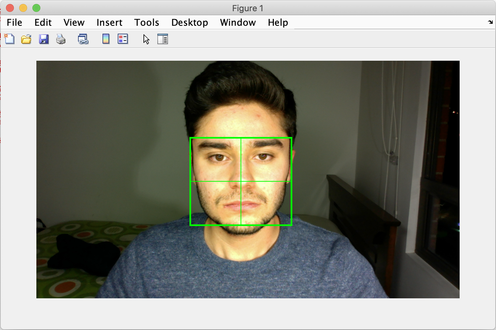

# Correlation Filters for Facial Recognition

In this Repo you will find MATLAB codes used to explore non-segmentation techniques for facial recognition using correlation techniques with linear filters. It is a project developed for the course on Optics and Acoustics from the National University of Colombia. It is carried out by:

* Diego Alejandro Herrera Rojas
* Luis Carlos Duran Neme
* Andrés Felipe Duque Bran
* Nicolás Alejandro Ávila Pérez

## Description

The main objective of the project is to design and implement a correlation-based static facial verification algorithm. That is, an algorithm that automates the recognition of a person using his or her face, with an accuracy higher than 80%. In order to achieve that goal, the following specific objectives were set:

* Determine an image database acquisition protocol that allows synthesis of a robust linear filter in terms of intensity and noise in the image.
* Develop an image acquisition routine that automates this part of the process.
* Implement a robust algorithm for filter design and synthesis, both for MACE and HBCOM filters.
* Implement normalization metrics that allow for correlation peak characterization and a confidence of 80% in facial verification.

## How to use the routines

For a detailed description of the theoretical and experimental reasons for the defined protocol of routines usage see the [wiki page](https://github.com/DiegoHerrera262/Correlation-Techniques-for-Face-Recognition/wiki) of the project. The protocol has the following steps:

* MATLAB environment setup.
* Image database acquisition.
* Image preprocessing.
* Filter synthesis.
* Performance simulation.
* Compute Performance Indicators.

Those are discussed further in the following subsections.

## MATLAB environment setup

Clone this repository to a folder in your local memory drive. Download MATLAB development environment from the official website and download the following add-ons from the official website:

* **Image Acquisition Toolbox** from MathWorks
* **Image Processing Toolbox** from MathWorks
* **Matlab Support Package for USB webcams** from MathWorks

We suggest using MATLAB 2017a version or later. The toolboxes above are necessary for subsequent steps of the protocol. Make sure they are installed before carrying on. On the MATLAB development environment open the root folder of the cloned repository in your PC. The MATLAB current folder window should look something like bellow:

<p align="center">
  
</p>

Make sure that your current folder window looks like that before going on. Then run the script **setup.m** in the command window as follows:

<p align="center">
  
</p>

This script should add the folder **Routines** to MATLABPATH and enable execution of the programs contained inside. Regular cleaning up of the workspace variables is advised in order to avoid conflicts. Also try to clean up the command window regularly. Use the commands:

```Matlab
clear varname;            % This deletes variable varname
clc;                      % This cleans command window like clear on command promt
```
Once your environment is set up you can:

* Generate an image database in your local hard drive.
* Compute a MACE, HBCOM or MINACE filter.
* Examine correlation outputs for a particular image in the database.
* Compute normalization metrics for peak quality assessment.
* Carry out performance simulations of one of those filters.

## Image database acquisition

This is the first step to carry out after repo cloning and environment setup. Database acquisition requires two steps:

1. Setting up of the illumination conditions and webcam for snapshot capture.
1. Calling function **acquire_data**.

### Setting up illumination conditions

This is a very important step. A proper illuminations reduces the noise in the captured snapshots. This is a feature quite desirable for improving the performance of the filters in facial recognition. Ideally, the set up should include 4 light sources with proper screening (i.e. a white paper sheet) coming from crossed directions, two lateral, one above and one bellow the face of the subject. If the last one is not feasible, then make sure the other three are available at all costs. A simple demo of the set up is shown in the image bellow.

<p align="center">
  
</p>

Once good illumination is ensured, run the routine **acquire_data**.

### Calling function acquire_data

This simple routine captures a definite number of snapshots and saves them in a folder with subjects name in **RawDatabase** folder. By default, images are stored in PNG format, since JPG loses too much information. This is automatically managed by the routine and user must not worry about that aspect. User must establish a webcam connection in MATLAB workspace. To do that, type ```webcamlist``` on command window. This will produce a cell object that contains the names of the possible USB webcams that MATLAB can access. Preferable connection is to built-in webcam. If none is available, it is suggested that user installs apps like **EpocCam** or **DroidCam** that allow management smartphones as USB webcams for several desktop applications. Keep in mind the index of the name of the desired connection. The type in the command window:

```Matlab
cam = webcam(idx)
```
Where ```idx``` stands for the index of the desired connection in the webcam list. If a connection to built-in camera is established, a green LED must turn on. If no semicolon is added, something like this should be prompted in the command window:

```Matlab
cam =

  webcam with properties:

                    Name: 'Cámara FaceTime HD (integrada)'
    AvailableResolutions: {'1280x720'}
              Resolution: '1280x720
```

Make sure that the resolution is 1280x720 for internal consistency. Change the resolution typing in the command window:

```Matlab
cam.Resolution = '1280x720'
```

**NOTE**: *If the available resolutions do not include this value, the programs can still be used but only with data taken with the same webcam*.

Once connection to webcam device is successfully stablished, execute:

```Matlab
acquire_data(num_samples,cam,subject_name)
```

* ```num_samples``` is the number of snapshots to be stored. It is suggested that exactly 199 samples be stored. This does not have to do with filter performance, but ensures consistency when carrying out performance simulations.

* ```cam``` is a webcam connection in MATLAB workspace.

* ```subject_name``` is a string that contains the first name of the subject. If already a folder in **RawDatabase** has that name, include the first letter of the last name, and so on.

Execute steps as in the [linked animation](https://github.com/DiegoHerrera262/Correlation-Techniques-for-Face-Recognition/blob/master/ProjLog/Results/README/demoAcqdata.mp4). A live video with a target will appear in the screen as shown:

<p align="center">
  
</p>

Please make sure that the images are properly centered by locating the nose on the center of the target. Also, make sure that the eyebrows and upper part of the chin are located at the upper limits of the box. Additionally, locate the lateral borders of the face in the corresponding sides of the box. It is advised that the image plane of the face remains constant while the facial expression is changed. However this is a user call. In order to save a snapshot, ***click the figure window and press s key***, always in that sequence. A message will appear on the command window ensuring that the snapshot was successfully saved.

If these steps are followed correctly, 199 PNG files with the names ```sample*.png``` must appear on the folder ```RawDatabase/Subject```. These images will be used for filter synthesis after preprocessing.

## Image Preprocessing

This step is fundamental for intensity adjustment and image de-noising. Preprocessed images are stored in the folder ```ProcessedDatabase/Subject_filtered```. The following preprocessing techniques are used:

1. Adaptative Histogram Equalization
1. De-nosing via Wiener filter.

These are implemented in the function ```filter_images```. The usage is quite elementary since internally all the hard processing and saving parts are carried out by the function. The user must enter in the command window:

```Matlab
filter_images(Subject)
```

Where ```Subject``` is a string with the name of the subject whose raw images are stored in the folder ```RawDatabase/Subject```. Once this is done, a new folder in the above mentioned location must appear with PNG files whose format name is ```filtered_sample*.png```. A sample of raw and preprocessed images is shown bellow:

<p align="center">
  
</p>

**NOTE**: *For more conceptual and procedural details of this part of the protocol visit the [wiki](https://github.com/DiegoHerrera262/Correlation-Techniques-for-Face-Recognition/wiki/Methodology) of the project repository*.

## Filter synthesis

This is the core step of the project. Chosen filters include HBCOM, MACE and MINACE. This are computed performing minimization algorithms. For more conceptual details visit the [wiki page](https://github.com/DiegoHerrera262/Correlation-Techniques-for-Face-Recognition/wiki/Linear-Filters) of the repository. The three routines:

* **HBCOM_Filter**
* **MACE_Filter**
* **MINACE_Filter**

work pretty much the same way. A training subset is chosen from the preprocessed database corresponding to a particular subject, and a number of images from this set is used to form a linear combination that optimizes certain physical property of the correlation plane. This linear combination in the image frequency space constitutes the filter. This filter is stored in the folder ```filters```, as a ```*.mat```  file. The prefix in the filename indicates the type of filter (HBCOM, MACE, MINACE, etc.). The filename includes subject name and a suffix **_filter**. The function returns the names of the figures used in the filter construction as a ***MATLAB cell object***.

To build an HBCOM filter, type in the command window:

```Matlab
usedImages = HBCOM_Filter(Subject,refimag,training_set_size)
```

* ```Subject``` is a string with the subject name whose preprocessed pictures have been stored on ```ProcessedDatabase/Subject_filtered```.

* ```refimag``` is an integer that indicates the image that is to be used as a reference to build the filter. This is read from ```ProcessedDatabase/Subject_filtered/filtered_sample(refimag).png```. For more details on this see the project wiki.

* ```training_set_size``` is an integer that indicates how many images are to be used in the construction of the filter, i.e. the number of images in the linear combination.

* ```usedImages``` is a **MATLAB cell** whose elements are the paths of the images used for the filter construction in user local hard drive. Access path of ith image by typing ```char(usedImages(i))```.

To build either a MACE or a MINACE, type in the command window:

```Matlab
usedImages = MACE_Filter(Subject,refimag,numimag,training_set_size)
usedImages = MINACE_Filter(Subject,refimag,numimag,training_set_size)
```

All the arguments retain pretty much the same meaning as for the HBCOM filter. ```numimag``` refers to the actual number of images from the training set that are used in the filter construction. For more details, see the wiki of the project.

If the synthesis was carried out correctly a filter must be stored in the above mentioned path, and a message in the command window will show all images that were used in the processes. A sample of the output is shown bellow:

<p align="center">
  
</p>

User can troubleshoot filter synthesis process using the function **demoFilter**. Type in the command window

```Matlab
demoFilter(refimag,Subject,filttype)
```

Where ```filttype``` is a string that indicates the type of the filter to be demonstrated: ```'HBCOM'```, ```'MACE'```, ```'MINACE'```. This demo produces a sample self-correlation output of the reference image with a filter built from it. If everything is set up correctly, the output should be as bellow.

<p align="center">
  
</p>

**NOTE:** *Keep MATLAB workspace clean to avoid confusion. Close windows that are of little or no importance*.

## Performance simulation

Once the filters are computed, the performance simulation has two important components:

1. Computation of the correlation plane or correlation output.
1. Computation of normalization metrics.

The first part emulates the actual intensity patter produced by an electro-optical correlator implementing the filter, while the second assesses the quality of the peak. The last part is what actually decides the face verification by proper theresholding of the metric.

### Computation of the correlation plane

This part is carried out by the function **CFxcorr**. This function takes as inputs a test image to be matched with a filter, the name of the subject used for comparison, and the type of filter to be used (HBCOM, MACE, MINACE, etc.). The output is a matrix that contains the scaled intensity pattern of the correlation plane in real space. The scaling is arbitrary and is just for visual purposes.

For usage, read a test image in the MATLAB workspace using ```imread()``` function. Documentation of usage can be seen typing ```doc imread``` in command window. Do that by typing:

```Matlab
test_im = imread('path/to/file');                      % Reads image to workspace
```

**NOTE:** *Semicolon is important because prevents MATLAB from displaying the image matrix on the command window*.

Once the test image is read, use the following commands to compute and display the correlation output

```Matlab
corplane = CFxcorr(test_im,Subject,filttype);          % Computes the correlation plane
surf(corplane);                                        % Displays corr. output
```

If everything is correct, a figure window must pop up and a sharp peak indicates high correlation, whereas noisy plane indicates little correlation. To assess the quality of the peak normalization metrics must be used to eliminate factors such as image intensity.

### Application of normalization metrics

The project contains two types of metric, **Peak to Correlation Energy (PCE)** and **Peak to Sidelobe Ration (PSR)**. Both functions receive as arguments the correlation plane, i.e. a double matrix, and return the metrics as defined in the wiki of the project.

To compute PCE, call the function **PCE**

```Matlab
pce = PSE(corrplane)
```

* ```pce``` is a double variable that contains the PCE metric of the plane.

* ```corrplane``` is a double matrix that represents the correlation output.

To compute PSR, call the function **PSR**

```Matlab
[pse, location] = PSR(corrplane)
```

* ```pse``` is a double variable that contains the PSR metric of the plane.

* ```location``` is a 2D double column vector that contains the location of the peak in the correlation plane.

A high normalization metric typically means strong correlation, while low value means weak correlation. The location of the peak is an indication of the spatial location of the biometric feature of interest, in the current application this would be the face. Further discussion in the wiki of the project.

### Shortcuts for performance simulation

In the project user can run **performSimulation** to automate the steps above and also compare performance over different image data. To use this function type in the command window

```Matlab
usedImages = performSimulation(trueSubject,falseSubject,refimag,numimag,filttype)
```

The program compares a filter built from database of subject ```trueSubject```, with the images inside that database, taken to be true class, and with images in an impostor set ```falseSubject```, taken to be false class. Note that the last three arguments are used to build a correlation filter as discussed above. ```usedImages```has the same meaning as discussed previously.

**NOTE:** *In general, a small proportion of the images in the true database are used to build the correlation filter. So an assessment of the performance of the filter inside the whole database is meaningful*.

If everything is correct, a figure window should pop up. It contains the PSR metric evaluated for each of the sample images in the true and false databases. Also the peak location for the images in the true database. The index is consistent with the name of the image in the database. That is, image number 10 corresponds to ```ProcessedDatabase/Subject_filtered/filtered_sample10.png```. So it is easier to check the whole correlation plane for a particular test image using **CFxcorr** function. A demo output is shown bellow.

<p align="center">
  
</p>

The mean values of PSR metric are shown, for both true and impostor class images. The location peaks are only shown for true class images. By using this plots user can

1. Zoom in on particularly good/bad performing images to determine particular features.
2. Determine thereshold metric value for identity verification.
3. Determine correlation between peak location and actual spatial location of a face.

**NOTE:** *This routine might be of great help for those users with little experience with MATLAB. It is advised that those users examine this routine in great extent. For more experienced users, the metric and plane-computation routines are the most fundamental ones.*

The main objective of this routine is to use it as a visual guide for filter training. The filter-building functions already incorporate image registration, but leave for the user the selection of the base image for filter training and the number of training images used to build the filter. This parameters affect the performance, and the user should select them carefully so as to produce a separation between classes as large as possible in terms of PSR metric. A special routine to assist the user called ```idealTrainingParameters``` is included. It returns the image over the true class set that the produces the highest separation between classes in terms of PSR metric for a given number of training images in the filter. Its usage is as follows:

```Matlab
[irefimag, indicator] = idealTrainingParameters(subject,numsamp,filttype)
```

* ```subject``` is the name of the folder of true-class images to be used in filter construction, i.e. the subject name.
* ```numsamp``` is the number of images to be used inside the filter.
* ```filttype``` is the type of filter to be built (e.g. HBCOM, MACE, MINACE).
* ```irefimag``` is an integer value that corresponds to the index of the image in the ```subject``` database that produces the larger separation of true-class and false-class for the datasets in ```ProcessedDatabase```.
* ```indicator``` is a double vector with the separation in PSR for the two classes when each of the images in the true-class dataset is used as a base for the synthesis.

**NOTE:** This routine is computationally intensive and might take several minutes to produce the desired output. It is advised that the user first tries ```performSimulation``` to assess visually if a particular base image and number of sample produces enough class discrimination. For HBCOM filters, a set of 4 training samples produces high discrimination, and for MACE filters, 2 is sometimes good enough. However, the selection of the base or reference image is more involved, and if a few random guesses don't produce high discrimination, then using ```idealTrainingParameters``` may save some time.

## Compute Performance Indicators.

Once the capabilities of a particular correlation filter are established and training is carried out, it is important to compute performance indicators. In the present application, the main objective is achieved by using the PSR metric of a correlation plane and a classifier algorithm to establish the presence of a biometric of interest via a binary decision. By thresholding the PSR metric, a classifier determines if the biometric is present in the image plane or not. For a given threshold metric value, there are 4 important quantities that indicate the capabilities of the algorithm for performing identity verification:

1. **True Positive Rate (TPR)**.
1. **False Negative Rate (FNR)**.
1. **False Positive Rate (FPR)**.
1. **True Negative Rate (TNR)**.

For a detailed description of the meaning and analysis of these metrics see the [wiki page](https://github.com/DiegoHerrera262/Correlation-Techniques-for-Face-Recognition/wiki/Performance-Analysis). There are routines that compute those indicators, and their names are identical to the acronyms. The usage is quite straightforward and is illustrated thusly:

```Matlab
tpr = FNR(subject,filttype,threshold)
```

* ```tpr``` is a double variable that corresponds to the **TPR** of the classifier with a *threshold metric value* ```threshold```.
* ```filttype``` is the type of filter to be built (e.g. HBCOM, MACE, MINACE).

Those indicators are more commonly reported in the so called **Confusion matrix**. For more conceptual details see the [wiki page](https://github.com/DiegoHerrera262/Correlation-Techniques-for-Face-Recognition/wiki/Performance-Analysis). There is a routine that computes this matrix:

```Matlab
ConfMat = ConfusionMatrix(subject,filttype,threshold)
```

* ```ConfMat``` is the confusion matrix associated to the particular classifier.

The rest of the variables have the same meaning as above. A good classifier has a confusion  matrix that resembles the identity. To chose a good value for the threshold metric value, a ROC space analysis should be carried out. The function ```ROC_Space``` generates a plot of the ROC space of the classifier algorithm when the threshold value is varied. It also returns the threshold metric values that produce a performance nearest to the ideal behavior. It is used as follows:

```Matlab
idealThreshold = ROC_Space(subject,filttype)
```

* ```idealThreshold``` is a double vector that contains the the threshold metric values that are nearest to the ideal behavior.

The rest of the variables have the same meaning as above. By using this routines the user can assess quantitatively the discrimination capacity of the correlation techniques treated in the project.

**NOTE:** A program that carries out all the Protocol steps over all datasets is in the file ```Protocol.m```. User must be careful with its use. Specially concerning the training process. The important steps of the process are divided in blocks (string ```%%```). Execution by steps is advised. If the user does not how to execute MATLAB programs by blocks, documentation can be found anywhere else.

## Conclusion

With this protocol, it is expected that the user creates his or her own database and explores the capabilities of non-segmentation biometric recognition techniques using linear correlation filters. In case of further advise, contact the members of the project via e-mail. The default contact address is  *diegoherrera262@gmail.com*. We hope that users of all degrees of experience enjoy playing with these routines and feel encouraged to explore further.
